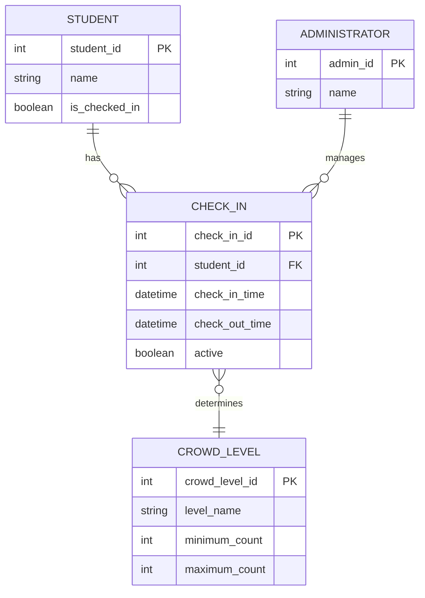

# AI-Generated Domain Model — First Draft

AI Tool: ChatGPT

Prompt:
Using my M2 requirements for the Gym Crowd Tracker, draft an ER domain model for the application. Provide the domain model in Mermaid ER diagram syntax. Include the entities, important attributes, and relationships you think the application needs.

## AI First Draft

