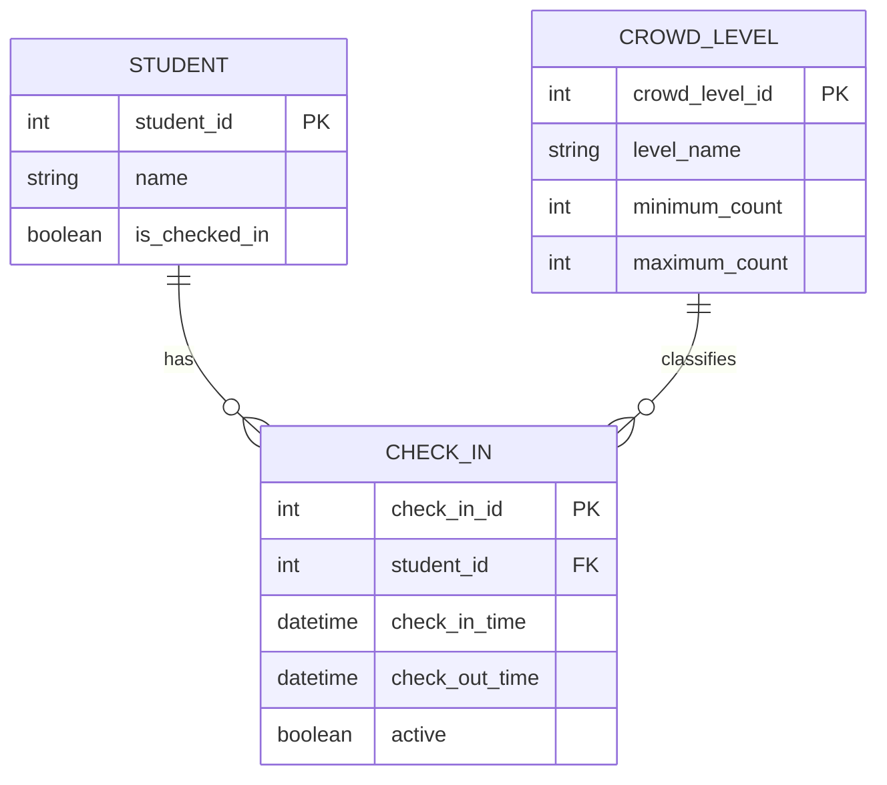

# Gym Crowd Tracker — Domain Model

## Final Reviewed Domain Model

## Critique of the AI Draft

The AI draft had some useful ideas, but it included more entities and relationships than the first version of the Gym Crowd Tracker needs.

### Where the AI Over-Modeled

The AI added an Administrator entity. Although the M2 requirements mention a system administrator as the user in one story, they do not require administrator accounts or administrator management features to be stored in the first version of the application. Because of this, the Administrator entity was removed from the final model.

### Where the AI Under-Modeled

The AI did not clearly explain how the current crowd count is calculated from all active check-ins. The M2 requirements state that the displayed crowd count must match the number of active check-ins and cannot become negative. The final design keeps the `active` status in Check-In so the application can determine which records should be included in the current crowd count.

### Relationship the AI Guessed

The AI connected Administrator directly to Check-In with a "manages" relationship. The M2 requirements do not state that an administrator manually manages individual check-ins, so this relationship was removed.

The AI also connected an individual Check-In to Crowd Level using a "determines" relationship. However, one check-in does not determine the crowd level by itself. The crowd level depends on the total number of active check-ins. The relationship was changed so Crowd Level represents a classification applied according to the active crowd count.

### Where the AI Was Right

The AI was correct to include Student and Check-In. Students need to check in and check out, and the application needs stored check-in information to calculate the current crowd count. The one-to-many relationship between Student and Check-In also makes sense because one student can have multiple gym visits over time.

The AI was also right to identify Crowd Level as an important concept because the M2 requirements specifically require the application to display Not Busy, Moderately Busy, or Very Busy.

### Final Changes

The final model keeps Student, Check-In, and Crowd Level because they directly support the M2 requirements. Administrator was removed because administrator accounts and management features are outside the current first-version scope. The relationships were also simplified so they better represent how students, check-ins, and crowd levels work in the application.